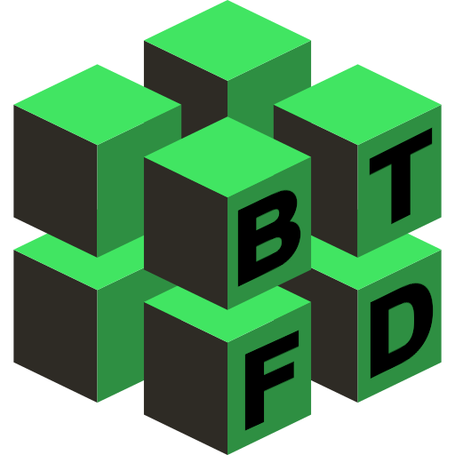

  

# BTFD 

This project was bootstrapped with [Create React App](https://github.com/facebook/create-react-app) and [React Electron](https://github.com/MaxRickettsUy/react-electron).

### Install [Mongodb](https://docs.mongodb.com/manual/installation/)
### Install [NodeJs](https://nodejs.org/en/https://docs.mongodb.com/manual/installation/)
### Install [Docker](https://docs.docker.com/engine/install/)
### Install [Docker Compose](https://docs.docker.com/compose/install/)

Claim API Key from [Alpha Advantage](https://www.alphavantage.co/support/#api-key) and set `API_KEY` in `backend/.env`

## To start application in browser with docker-compose

### From project directory
#### `docker-compose build`
#### `docker-compose up`
#### Open in browser at `localhost:8000`

## To start application as Electron application or brower with npm

### From `/backend`
#### `npm install`
#### `node /backend/server.js`

### From `/ui`
#### `npm install`
#### `npm run start:electron`

## Same Available Scripts from Create React App
